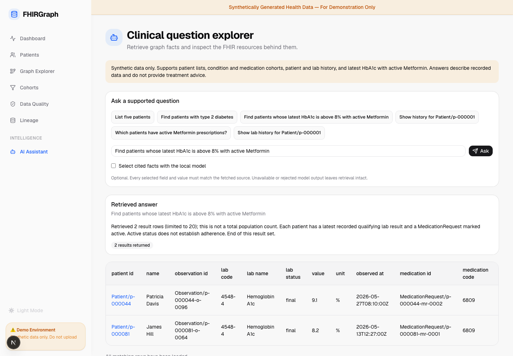
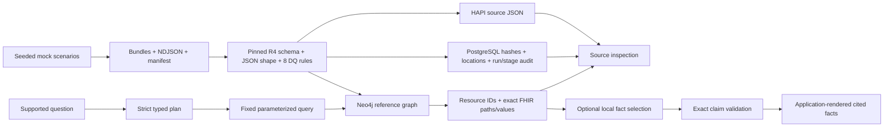

# FHIRGraph

[Portfolio](https://pk-999.github.io/fhir_graph_rag/) · [Case study](docs/CASE_STUDY.md) · [Release evidence](docs/evidence/portfolio-release.json)

**Synthetic FHIR → reference graph → answers with inspectable evidence.** A personal portfolio project demonstrating healthcare data engineering, grounded graph retrieval and ingestion provenance with fictional records.

[Portfolio case study](https://pk-999.github.io/fhir_graph_rag/) · [Recorded walkthrough](portfolio/dist/assets/walkthrough.mp4) · [Engineering case study](docs/CASE_STUDY.md) · [Release evidence](docs/evidence/portfolio-release.json)



## Quickstart

Requires Python 3.12+, Node.js 22+, Docker Desktop/Compose, and initial network access for dependencies/images. Supported retrieval requires no paid API or model.

```bash
make setup           # locked Python dependencies, npm ci, Chromium, local .env
make demo            # five-service stack; generate, validate, ingest, reconcile, evaluate
make verify-demo     # readiness, complete retrieval evaluation and live browser walkthrough
```

Open [the application](http://localhost:4010) or [API documentation](http://localhost:8010/docs). `make down` retains volumes. The default project is `fhirgraph-demo`; artifacts are in `artifacts/demo`. `make setup` preserves an existing `.env`.

The audited pipeline supports one registered dataset per store. A different seed, patient count, or changed serialization uses a **fresh Compose project and output**. For this release, an earlier dataset containing empty FHIR arrays is preserved in its original volumes. To migrate without deleting it:

```bash
make down
cp .env .env.release
# Change COMPOSE_PROJECT_NAME in .env.release to fhirgraph-release.
make ENV_FILE=.env.release OUTPUT=artifacts/release-demo demo
make ENV_FILE=.env.release OUTPUT=artifacts/release-demo verify-demo
```

`ENV_FILE` selects both Compose and pipeline configuration. Keep local credential files private. Alternate ports must agree between the Compose `FHIRGRAPH_*` bindings and pipeline service URLs, as shown in `.env.example`.

## Explore the running project

1. **Dashboard and Patients:** inspect actual counts, search records, open a timeline and the original Patient JSON.
2. **Graph Explorer:** expand recorded FHIR references and inspect resource properties. Overview grouping edges are labeled separately.
3. **Question explorer:** ask a supported question, follow all result pages, then inspect the exact source and its provenance.
4. **Data Quality:** inspect the persisted run, dataset hash, actual stage outcome and eight independent rules.
5. Ask for treatment advice or an unsupported extra filter to see explicit abstention.

| Intent | Example |
|---|---|
| Patient listing | List five patients |
| Condition cohort | Find patients with type 2 diabetes |
| Medication cohort | Which patients have active Metformin prescriptions? |
| Latest lab + medication | Find patients whose latest HbA1c is above 8% with active Metformin |
| Recorded history | Show history for Patient/p-000001 |
| Lab history | Show lab history for Patient/p-000001 |

HbA1c history can be narrowed with `Show HbA1c history for Patient/p-000044`. Queries describe recorded data. Prescription status does not establish adherence; returned page size is not a population count.

## Grounding and architecture



The parser matches complete questions and abstains when it cannot preserve their meaning. The application owns Cypher templates, parameterization, read access, timeouts and bounded pages. Latest lab selection happens **before** threshold/unit filtering; timestamps use UTC seconds and nanoseconds with deterministic ties. Medication cohorts select one deterministic active request per patient.

Optional **local Ollama** runs separately. Install a model yourself, set `LLM_MODEL` in the selected environment, and use the UI's fact-selection checkbox or `use_summary_model:true`. Model output must select exact resource/field/value triples; numeric strings, invented values, prose and extra keys are rejected. Selection is bounded to a few candidate facts and application-rendered wording. Rejected or unavailable output leaves deterministic retrieval available. `use_model:true` enables experimental plan parsing only when its meaning agrees with the supported deterministic plan.

FHIR preflight validates the pinned official R4 4.0.1 schema and labeled JSON shape checks, including finite numbers and nonempty arrays. A compact index resolves relative and explicitly configured same-service absolute references; Bundle validation resolves fullUrl/URN aliases in their Bundle context. The NDJSON graph builder has no Bundle alias map and diagnoses URNs instead of guessing their targets. Contained resources retain their source context. Unresolved/external/unsupported references are diagnosed before writes. Contained references do not invent top-level graph nodes.

Graph input is disk-spooled, transformed in batches of 500 after full preflight, and written idempotently. FHIR uploads have bounded concurrency and load shared resources first. Content-bound checkpoints confirm only successful batches. Audit provenance records canonical artifact hashes, source file/location, dataset, transformer version, sanitized target and run/stage. Historical rows without this evidence remain unavailable.

## Verify and measure

```bash
make check              # Python lint/types/tests + frontend lint/types/unit/build + Compose
make browser-check      # controlled graph, cohort and question-explorer regressions
make smoke              # real API readiness and web checks
make evaluate           # all 33 independent cases, complete pages, exact live FHIR sources
make verify-demo        # smoke + evaluation + live browser walkthrough
make benchmark          # isolated 1,000-patient stack, measurements and recovery proof
```

The evaluator independently reads raw NDJSON, checks all six intents, complete ordering/pagination, code displays, source fields, combined filters, zero matches and abstention. It fetches each distinct cited FHIR resource and validates identity, patient association and exact facts. Optional `--use-summary-model` plus repeated `--case-id` selects explicit local-model evaluation coverage; the default evaluates all 33 retrieval cases.

Fresh release evidence includes 438 Python tests, 21 controlled browser regressions, a live walkthrough, eight passing DQ rules, and a 100-patient demo with **7,957 resources / graph nodes and 17,130 exact references**. All 33 retrieval cases pass across 79 pages with 246 distinct source checks. The local `llama3.1:latest` model passed the selected latest-lab/medication and medication-cohort cases with 36 distinct sources checked; this does not claim model coverage of every query intent.

The benchmark creates independent credentials, ports and volumes under `fhirgraph-benchmark`, writes `artifacts/release-scale/benchmark.json`, and stops its containers while retaining data. It records actual stage durations, store counts, 20 sequential API latency samples, Docker memory observations and graph-child interruption/resumption. These are local workload measurements, not production capacity estimates. Full measured results appear in the release evidence and case study.

## Scope and code map

`libs/synthetic`: generation · `libs/fhir`: models, validation and references · `libs/quality`: independent checks · `libs/graph`: transformation/load · `libs/rag`: plans, retrieval, evidence and claims · `pipelines`: audited orchestration/checkpoints · `apps/api`: FastAPI · `apps/web`: Next.js · `scripts`: evaluation/benchmark/recording · `portfolio`: static presentation.

This project uses mock data and a bounded graph RAG catalog. Full profile, FHIRPath invariant and terminology conformance, unrestricted semantic/vector search, clinical advice, authenticated public healthcare APIs and production load guarantees are outside its scope.

Checkpoint recovery assumes the persistent store is unchanged. Store replacement/drift at the same address requires standalone `load_fhir`/`build_graph --no-resume` replay and reconciliation; no global rollback or automatic deletion is performed. Standalone loaders bypass the orchestration's single-dataset guard. Provenance hashes describe artifact JSON before server-managed metadata, not a full live-store integrity probe. Offset pages are stable for the registered dataset and do not provide a snapshot during manual edits/concurrent ingestion.

[Architecture](docs/ARCHITECTURE.md) · [API contract](docs/API_CONTRACT.md) · [Graph schema](docs/GRAPH_SCHEMA.md) · [Historical review](docs/PROJECT_REVIEW.md)
