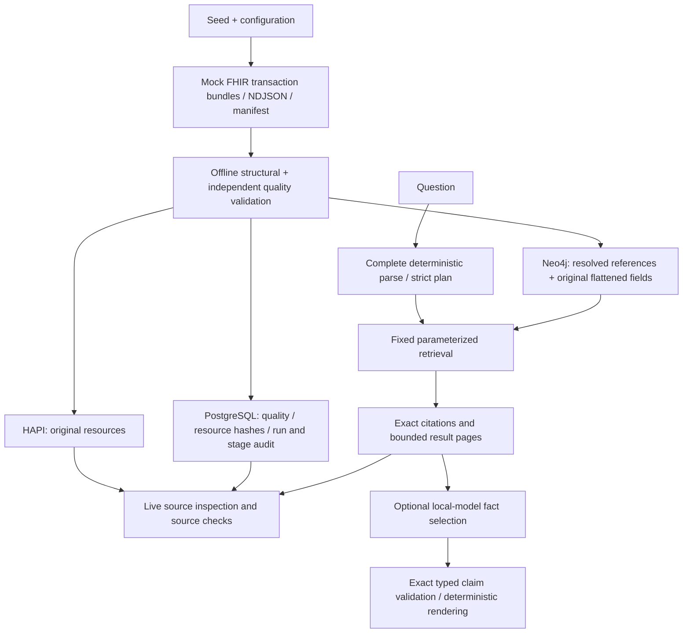

# FHIRGraph: a grounded healthcare graph portfolio

FHIRGraph follows fictional healthcare records from seeded generation to inspectable answers. The goal is a small, complete engineering system whose claims can be traced through a source resource and confirmed ingestion event.

## Problem and resulting behavior

Flattening FHIR into a graph makes retrieval convenient but can obscure source meaning. Unrestricted query generation and clinical-looking text can compound that problem. This project keeps the original serialized FHIR in HAPI, compiles a bounded question catalog into application-owned queries, and returns resource IDs with exact field/value citations.

A sample question asks for patients whose latest HbA1c exceeds 8% with an active Metformin prescription. The 100-patient seed returns two records. One is `Patient/p-000044`: `Observation/p-000044-o-0096` records 9.1% on `2026-05-27T08:10:00Z`; `MedicationRequest/p-000044-mr-0002` is marked active. The answer makes no adherence or treatment claim. The UI opens both exact JSON and artifact-to-stage provenance.

## Architecture and decisions

- **Source preservation:** Explicitly configured same-service absolute references resolve to canonical graph targets without rewriting their original citation strings. Bundle validation also resolves fullUrl/URN aliases in Bundle context; the NDJSON graph builder diagnoses URNs without an alias map. Contained resources do not become invented top-level nodes.
- **Bounded semantics:** Six query intents cover patient lists, condition/medication cohorts, latest labs with medication, and patient/lab histories. Unsupported meaning abstains. Latest observation selection precedes threshold filtering.
- **Grounded local model:** Ollama selects typed candidate facts; the application rejects any altered field, value, type or resource. A first clinical trial returned numbers as strings and was correctly rejected. Explicit typed candidates corrected that case without weakening validation.
- **Validation scope:** The unchanged, checksum-pinned official R4 4.0.1 schema is supplemented with labeled JSON shape checks. These checks caught generated empty arrays and Python's permissive NaN/Infinity parsing. Full profiles, invariants and terminology remain outside scope.
- **Recovery:** Full preflight precedes mutations. Disk snapshots and bounded transactions/tasks reduce memory pressure. Checkpoints bind input content, destination, transformation and batch partition, and record only confirmed success. Recovery retains the same persistent store.
- **Provenance:** Source artifact/location, canonical JSON hash, dataset hash, run, transformer and confirmed target stage are separate from server-managed metadata. Older audit schemas return unavailable evidence until migration; no historical hashes are fabricated.

## Verification

Release verification uses an independent raw-NDJSON oracle with complete page traversal and exact live resource checks. Unit regressions exercise adversarial filters, wrong units/statuses, timestamp ties, missing/non-numeric values, source drift, claim rejection, changed checkpoint bindings, interrupted writes and legacy schemas. Live reconciliation checks exact graph identities and references plus per-type HAPI counts.

The 100-patient release has 1,468 encounters, 7,957 resources, 17,130 reference edges and eight passing data-quality rules. All 33 deterministic evaluation cases pass across 79 pages; 246 distinct live sources match. The selected local-model clinical cases pass with 36 live sources checked. The full quality gate includes 438 Python tests, strict types/lint and a production frontend build; 21 controlled Chromium regressions and the real local walkthrough pass.

See the [recorded walkthrough](../portfolio/dist/assets/walkthrough.mp4), [machine-readable release evidence](evidence/portfolio-release.json) and [benchmark report](evidence/benchmark-1000.json) for measured scale evidence. The benchmark is isolated from the original demo, preserves all volumes, and records exact workload/timing/memory/latency scope. Recovery replays an already populated graph with an interrupted child process; it does not claim interrupted initial empty-store ingestion or store-recreation recovery.

## Tradeoffs and future extensions

The flattened property schema uses positional array indices, so it favors the generated vocabulary over generalized terminology reasoning. The graph stores recorded associations, not causal edges. Offset pagination provides deterministic ordering on a stable dataset, not a snapshot under concurrent edits. Local-model selection enriches inspection rather than generating clinical narratives.

A future production project would need authenticated deployment, least-privilege managed data access, stronger profile/terminology conformance, broader clinically reviewed semantics, store-generation binding/live drift detection, snapshot pagination and concurrent load testing. Those are separate objectives from this finished mock-data portfolio release.

## Reproduce

Run `make setup`, `make demo`, `make verify-demo`, `make check`, `make browser-check`, and `make benchmark`. The README explains safe migration to a new Compose namespace when generated hashes change. A clean checkout and remote GitHub Actions verify installation and the full demo from committed source.
