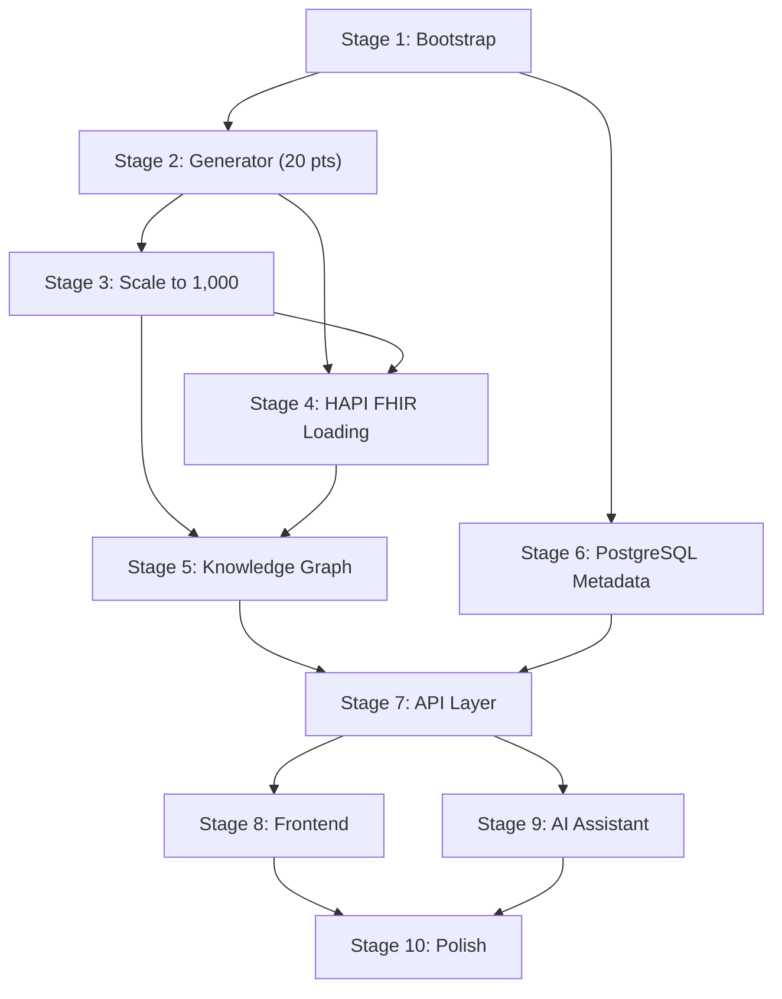

# FHIRGraph — Full Implementation Plan

> **Historical plan notice (2026-09-01):** This document records the original greenfield implementation sequence and contains completion claims that have not all been reverified against the current code. The approved target design is [`superpowers/specs/2026-09-01-fhirgraph-finish-line-design.md`](superpowers/specs/2026-09-01-fhirgraph-finish-line-design.md), and current verified status is maintained in [`FINISH_LINE_TRACKER.md`](FINISH_LINE_TRACKER.md). A new task-by-task execution plan will supersede this document after design review.

## Background

This is a greenfield project. The repository contains only 9 specification documents and no source code. The goal is to build a portfolio-quality healthcare knowledge-graph platform that generates 1,000 synthetic FHIR R4 patients, loads them into a knowledge graph, and provides 9 distinct UI experiences (Dashboard, Patient Search, Patient 360, Timeline, Graph Explorer, Cohort Builder, Data Quality, Lineage, AI Assistant).

## Architecture Changes Made

Updated [ARCHITECTURE.md](file:///Users/apple/codes/fhir_graph_rag/docs/ARCHITECTURE.md) with:
- **Concrete directory tree** — replaced vague `services/` with `libs/` (framework-free shared libraries) + `apps/` (deployable services) separation
- **Container topology** — explicit Docker Compose service map with ports
- **PostgreSQL schema outline** — `pipeline_runs`, `data_quality_results`, `lineage_mappings`, `ingestion_events`
- **Cross-cutting concerns** — observability (structlog, OpenTelemetry, Prometheus), config management, request-ID propagation

> [!IMPORTANT]
> The key structural change: `services/*` → `libs/*` for shared libraries (pure Python, no framework deps) and `apps/*` for deployable services. This prevents circular dependencies and makes each lib independently testable.

---

## Stage 1: Repository Bootstrap (Milestone 0)

**Goal**: One command starts all infrastructure; API and web health pages respond.

### Step 1.1 — Root project scaffolding
| Item | Detail |
|------|--------|
| Files | `pyproject.toml` (root workspace), `Makefile`, `.gitignore`, `.env.example`, `README.md` |
| Actions | Configure Python workspace with `hatch` or `uv` workspaces. Define shared dev deps (ruff, mypy, pytest). Create `Makefile` targets: `make dev`, `make lint`, `make test`, `make generate`. |

### Step 1.2 — Docker Compose infrastructure
| Item | Detail |
|------|--------|
| Files | `infra/docker-compose.yml`, `infra/docker-compose.dev.yml`, `infra/neo4j/neo4j.conf`, `infra/hapi/application.yaml`, `infra/postgres/init.sql` |
| Actions | Define 5 services (postgres, neo4j, hapi-fhir, api, web). Postgres init script creates schema. Neo4j config sets `AUTH=neo4j/password`. HAPI uses R4. Dev overrides mount source volumes for hot-reload. |

### Step 1.3 — FastAPI skeleton
| Item | Detail |
|------|--------|
| Files | `apps/api/pyproject.toml`, `apps/api/Dockerfile`, `apps/api/app/main.py`, `apps/api/app/config.py`, `apps/api/app/dependencies.py`, `apps/api/app/routers/health.py` |
| Actions | App factory with lifespan (connect Neo4j, PG on startup; close on shutdown). Health endpoint returns `{"status":"ok","neo4j":bool,"postgres":bool}`. CORS middleware. Request-ID middleware. |

### Step 1.4 — Next.js skeleton
| Item | Detail |
|------|--------|
| Files | `apps/web/package.json`, `apps/web/Dockerfile`, `apps/web/src/app/layout.tsx`, `apps/web/src/app/page.tsx`, `apps/web/tailwind.config.ts`, `apps/web/tsconfig.json` |
| Actions | Initialize with `create-next-app` (App Router, TypeScript strict, Tailwind). Install shadcn/ui. Create root layout with safety banner: *"Synthetic demonstration data only."*. Health page shows API connectivity status. |

### Step 1.5 — CI skeleton
| Item | Detail |
|------|--------|
| Files | `.github/workflows/ci.yml` |
| Actions | Lint (ruff, eslint), type-check (mypy, tsc), test (pytest, vitest). Runs on PR and push to main. |

**Exit criteria**:
- [x] `docker compose up` starts all 5 services
- [x] `GET /api/v1/health` returns 200
- [x] `localhost:3000` shows the Next.js shell with safety banner
- [x] `make lint` and `make test` pass (even if test suite is near-empty)

---

## Stage 2: Deterministic Synthetic FHIR Generator — 20 Patients (Milestone 1)

**Goal**: Generate 20 patients with 10–20 encounters each, zero dangling references, deterministic reproducibility.

### Step 2.1 — FHIR models & serialization (`libs/fhir`)
| Item | Detail |
|------|--------|
| Files | `libs/fhir/models/patient.py`, `libs/fhir/models/encounter.py`, `libs/fhir/models/condition.py`, `libs/fhir/models/observation.py`, `libs/fhir/models/medication.py`, `libs/fhir/models/medication_request.py`, `libs/fhir/models/practitioner.py`, `libs/fhir/models/organization.py`, `libs/fhir/models/allergy_intolerance.py`, `libs/fhir/models/procedure.py`, `libs/fhir/models/diagnostic_report.py`, `libs/fhir/models/service_request.py`, `libs/fhir/bundle.py`, `libs/fhir/ndjson.py`, `libs/fhir/references.py` |
| Actions | Pydantic models mirroring FHIR R4 structure for V1 resources. Bundle builder. NDJSON writer. Reference extractor that walks any resource and yields all `reference` fields. |
| Tests | Serialization round-trip. Reference extraction correctness. Bundle structure validation. |

### Step 2.2 — Curated terminology catalogs (`references/`)
| Item | Detail |
|------|--------|
| Files | `references/snomed_subset.json`, `references/loinc_subset.json`, `references/rxnorm_subset.json`, `references/icd10_subset.json` |
| Actions | Curate small coded catalogs: ~30 SNOMED conditions, ~20 LOINC observations, ~20 RxNorm medications, ~30 ICD-10 codes. Each entry has `code`, `system`, `display`. Used by archetypes for realistic coding. |

### Step 2.3 — Generator core (`libs/synthetic`)
| Item | Detail |
|------|--------|
| Files | `libs/synthetic/config.py`, `libs/synthetic/id_factory.py`, `libs/synthetic/demographics.py`, `libs/synthetic/pools.py`, `libs/synthetic/registry.py` |
| Key details | **config.py**: Pydantic model matching the YAML spec (seed, patient_count, encounters min/max, history_years). **id_factory.py**: `IdFactory(seed)` → deterministic `Patient/p-000001`, `Encounter/p-000001-e-0007` etc. **demographics.py**: seeded RNG → name, DoB (age bands), gender, address, phone, email. **pools.py**: create 8–15 Organizations, 50–100 Practitioners (attached to orgs/specialties). **registry.py**: in-memory `ResourceRegistry` tracks all created resource IDs + all references as edges. |
| Tests | ID determinism (same seed → same IDs). Demographics distribution validation. Pool size assertions. Registry dangling-reference detection. |

### Step 2.4 — Clinical archetypes (initial 3)
| Item | Detail |
|------|--------|
| Files | `libs/synthetic/archetypes/base.py`, `libs/synthetic/archetypes/healthy.py`, `libs/synthetic/archetypes/diabetes.py`, `libs/synthetic/archetypes/hypertension.py` |
| Actions | **base.py**: `ClinicalArchetype` abstract base — `apply(patient, encounter, state, rng) → list[Resource]`. **healthy.py**: vitals + preventive labs. **diabetes.py**: glucose/HbA1c observations → Condition → MedicationRequest (Metformin). **hypertension.py**: BP observations → Condition → MedicationRequest (Lisinopril). Each archetype implements a state machine that evolves chronologically across encounters. |
| Tests | State transitions produce correct resource sequences. No downstream events before prerequisites. Values within plausible bounds. |

### Step 2.5 — Encounter generator & runner
| Item | Detail |
|------|--------|
| Files | `libs/synthetic/encounter_gen.py`, `libs/synthetic/runner.py` |
| Actions | **encounter_gen.py**: For each patient, generate 10–20 encounters spread across `history_years`. Mix of outpatient/wellness/urgent/emergency/inpatient. Link Practitioner + Organization. For each encounter, run applicable archetypes to emit Conditions, Observations, MedicationRequests, etc. **runner.py**: Top-level orchestrator: create pools → for each patient: generate demographics → assign 0–3 archetypes → generate encounters → register all resources → validate registry → write Bundles + NDJSON + DQ report. |
| Tests | Encounter count bounds (10–20 per patient). Temporal consistency (no encounter before birth, start ≤ end). Reference resolution (100% of subject/encounter refs resolve). |

### Step 2.6 — Validation pipeline & DQ report
| Item | Detail |
|------|--------|
| Files | `libs/quality/rules.py`, `libs/quality/runner.py`, `libs/quality/models.py` |
| Actions | 8 validation rules per spec: schema validation, duplicate ID check, reference resolution, temporal consistency, coded-value check, encounter-count assertion, clinical-scenario consistency, aggregate distribution report. Output `artifacts/data_quality_summary.json`. |
| Tests | Introduce deliberate failures and verify detection. |

### Step 2.7 — Pipeline CLI
| Item | Detail |
|------|--------|
| Files | `pipelines/generate.py`, `pipelines/validate.py` |
| Actions | CLI wrappers using `click` or `argparse`. `python -m pipelines.generate --patients 20 --seed 20260830`. `python -m pipelines.validate --input artifacts/`. |

### Step 2.8 — Reproducibility test
| Item | Detail |
|------|--------|
| Files | `libs/synthetic/tests/test_reproducibility.py` |
| Actions | Generate 20 patients twice with same seed. Canonicalize JSON. Compare hashes. Must match. |

**Exit criteria**:
- [x] `make generate PATIENTS=20` produces Bundles + NDJSON
- [x] Exactly 20 patients, 10–20 encounters each
- [x] Zero dangling references
- [x] DQ summary JSON produced with all assertions passing
- [x] Reproducibility hash test passes
- [x] `make lint && make test` pass

---

## Stage 3: Full 1,000-Patient Dataset (Milestone 2)

**Goal**: Scale to 1,000 patients with all V1 archetypes and resource types.

### Step 3.1 — Remaining clinical archetypes
| Item | Detail |
|------|--------|
| Files | `libs/synthetic/archetypes/hyperlipidemia.py`, `asthma.py`, `copd.py`, `obesity.py`, `ckd.py`, `ihd.py`, `pregnancy.py`, `ari.py`, `msk_injury.py` |
| Actions | Implement all 12 archetypes from the spec. Compatibility constraints: pregnancy only for biologically compatible demographics; COPD rare in children; T2D prevalence rises with age. Each archetype emits the right mix of Conditions, Observations, MedicationRequests, Procedures, DiagnosticReports, ServiceRequests. |

### Step 3.2 — AllergyIntolerance, Procedure, DiagnosticReport, ServiceRequest generation
| Item | Detail |
|------|--------|
| Actions | Ensure all V1 resource types are generated by the relevant archetypes. Maintain `ServiceRequest → DiagnosticReport/Procedure → Observation` chains. |

### Step 3.3 — Scale test
| Item | Detail |
|------|--------|
| Actions | Run `make generate PATIENTS=1000`. Verify ~15,000 encounters. Run full DQ suite. Profile memory and time. Target: < 5 minutes on dev hardware. |

**Exit criteria**:
- [x] 1,000 patients, ~15,000 encounters
- [x] All 12 V1 archetypes active
- [x] All V1 resource types generated
- [x] All DQ gates pass
- [x] Aggregate distribution report produced

---

## Stage 4: HAPI FHIR Server Loading (Milestone 3)

**Goal**: Generated FHIR Bundles loaded into HAPI FHIR; counts reconcile.

### Step 4.1 — HAPI FHIR loader
| Item | Detail |
|------|--------|
| Files | `pipelines/load_fhir.py`, `libs/fhir/loader.py` |
| Actions | Read per-patient Bundles. POST transaction Bundles to HAPI FHIR `/fhir`. Batch to avoid timeout (e.g., 50 patients per batch). Retry with exponential backoff on 429/5xx. Log errors per resource. |

### Step 4.2 — Reconciliation
| Item | Detail |
|------|--------|
| Files | `pipelines/reconcile.py` |
| Actions | Query HAPI FHIR `/{ResourceType}?_summary=count` for each type. Compare with generated counts from DQ report. Fail if mismatch > 0. |

**Exit criteria**:
- [x] All resources loaded into HAPI FHIR
- [x] Count reconciliation passes for all resource types
- [x] Retry/error handling covers transient failures

---

## Stage 5: Knowledge Graph (Milestone 4)

**Goal**: FHIR data transformed into canonical graph representation and loaded into Neo4j.

### Step 5.1 — Graph canonical model
| Item | Detail |
|------|--------|
| Files | `libs/graph/schema.py`, `libs/graph/transformer.py` |
| Actions | `GraphNode(id, labels, properties)` and `GraphEdge(source, type, target, properties)` Pydantic models. `FHIRToGraphTransformer` walks FHIR resources and emits nodes + edges per the GRAPH_SCHEMA relationships. Creates instance nodes (Patient, Encounter, …), terminology nodes (ClinicalConcept, LOINCConcept, …), governance nodes (IngestionRun, SourceSystem, …). |

### Step 5.2 — Neo4j constraints & indexes
| Item | Detail |
|------|--------|
| Files | `libs/graph/constraints.py` |
| Actions | Generate and execute `CREATE CONSTRAINT … IF NOT EXISTS` for all major labels. Create indexes on `Patient.display_name`, `Condition.code`, `Observation.code`, `Medication.code`, `Encounter.start`. |

### Step 5.3 — Neo4j MERGE loader
| Item | Detail |
|------|--------|
| Files | `libs/graph/loader.py` |
| Actions | Batch MERGE queries using `neo4j` Python driver. Use `UNWIND` for bulk operations. Idempotent: repeated load must not duplicate nodes or edges. |

### Step 5.4 — Derived semantic edges
| Item | Detail |
|------|--------|
| Actions | After instance nodes are loaded, compute `SUPPORTED_BY` and `ASSOCIATED_WITH_MEDICATION` edges based on temporal + patient co-occurrence. Each edge stores `derivation_rule`, `source_resource_ids`, `generated_at`. |

### Step 5.5 — Graph reconciliation
| Item | Detail |
|------|--------|
| Files | `pipelines/build_graph.py` |
| Actions | Count nodes by label, edges by type. Compare with expected counts from transformer. Verify idempotency by loading twice and asserting same counts. |

**Exit criteria**:
- [x] Neo4j contains all instance, terminology, and governance nodes
- [x] All relationships from GRAPH_SCHEMA present
- [x] Repeated load does not duplicate nodes/edges
- [x] Graph reconciliation counts match

---

## Stage 6: PostgreSQL Metadata & Lineage

**Goal**: Pipeline run metadata, DQ results, and lineage mappings stored in PostgreSQL.

### Step 6.1 — Database migrations
| Item | Detail |
|------|--------|
| Files | `migrations/` (Alembic), `apps/api/app/db/` |
| Actions | Alembic migration for tables: `pipeline_runs`, `data_quality_results`, `ingestion_events`, `lineage_mappings`. |

### Step 6.2 — Pipeline run tracking
| Item | Detail |
|------|--------|
| Actions | Each pipeline execution creates a `pipeline_run` record with run_id, status, start/end timestamps, config snapshot. DQ results linked to run_id. |

### Step 6.3 — Lineage data
| Item | Detail |
|------|--------|
| Actions | Seed lineage mappings: Business Domain → Business Entity → Business Attribute → FHIR Element → FHIR Resource Type. Example: "Lab Results" → "HbA1c" → "value" → `Observation.valueQuantity` → `Observation`. |

**Exit criteria**:
- [x] Migrations run cleanly
- [x] Pipeline runs tracked with status and timestamps
- [x] Lineage chain traceable end-to-end

---

## Stage 7: API Layer (Milestone 5)

**Goal**: All API endpoints from API_CONTRACT implemented and tested.

### Step 7.1 — Dashboard API
| Files | `apps/api/app/routers/dashboard.py` |
| Actions | `GET /api/v1/dashboard/summary` → patient count, encounter count, condition/observation/medication/procedure counts, graph node/edge counts, DQ pass rate, latest ingestion run. Queries Neo4j + PostgreSQL. |

### Step 7.2 — Patient APIs
| Files | `apps/api/app/routers/patients.py` |
| Actions | Search (`GET /patients?q=&condition=&limit=&cursor=`), detail (`GET /patients/{id}`), timeline (`GET /patients/{id}/timeline`), graph (`GET /patients/{id}/graph?depth=2`), FHIR JSON (`GET /patients/{id}/fhir`), provenance (`GET /patients/{id}/provenance`). |

### Step 7.3 — Graph APIs
| Files | `apps/api/app/routers/graph.py` |
| Actions | Node detail, neighbors (with relationship/depth filters), path finding. All queries parameterized, bounded, max traversal depth enforced. |

### Step 7.4 — Cohort API
| Files | `apps/api/app/routers/cohorts.py` |
| Actions | `POST /cohorts/query` — translate filter predicates to Cypher. Support AND filters: age, condition, medication, observation code, observation threshold, encounter type. |

### Step 7.5 — Data Quality & Lineage APIs
| Files | `apps/api/app/routers/data_quality.py`, `apps/api/app/routers/lineage.py` |
| Actions | DQ summary, issues list, pipeline runs from PostgreSQL. Lineage trace from business term through to FHIR resource instance. |

### Step 7.6 — AI Assistant API
| Files | `apps/api/app/routers/assistant.py` |
| Actions | `POST /assistant/query` — intent classification → template selection → parameter filling → Cypher execution → evidence formatting. Cypher validation enforces read-only, LIMIT, no mutation. |

### Step 7.7 — API contract tests
| Item | Detail |
|------|--------|
| Actions | Pydantic response model validation. Integration tests against test fixtures. |

**Exit criteria**:
- [x] All endpoints from API_CONTRACT respond correctly
- [x] Response schemas match Pydantic models
- [x] p95 latencies within performance targets
- [x] AI endpoint rejects mutation queries

---

## Stage 8: Frontend (Milestone 6)

**Goal**: All 8 UI experiences from PRODUCT_SPEC implemented.

### Step 8.1 — Design system & layout
| Item | Detail |
|------|--------|
| Actions | shadcn/ui component library setup. Dark mode. Sidebar navigation. Safety banner on every page. Responsive layout. |

### Step 8.2 — Dashboard page
| Actions | KPI cards (patient count, encounter count, conditions, observations, medications, procedures, graph nodes/edges, DQ pass rate, latest run). |

### Step 8.3 — Patient Search page
| Actions | Search bar with filters (name, ID, age range, gender, condition). Results table with pagination. Click-through to Patient 360. |

### Step 8.4 — Patient 360 page
| Actions | 5 tabs: Summary (demographics, active conditions, current medications, recent observations, allergies, recent encounters), Timeline, Knowledge Graph, FHIR JSON, Provenance. |

### Step 8.5 — Timeline component
| Actions | Chronological display of encounters, conditions, medications, observations, procedures. Filterable by resource type. Visual timeline (vertical). |

### Step 8.6 — Graph Explorer page
| Actions | Cytoscape.js interactive graph. Click to expand nodes. Filters: node type, relationship type, date range, graph depth slider. Node detail panel. |

### Step 8.7 — Cohort Builder page
| Actions | Dynamic AND filter builder UI. Add/remove filter rows (field dropdown, operator dropdown, value input). Execute query → results table. |

### Step 8.8 — Data Quality page
| Actions | Resource counts table. Pass rates (referential integrity, schema validation). Missing-code stats. Invalid timeline stats. Failed records with reason (expandable table). |

### Step 8.9 — Lineage page
| Actions | Interactive lineage visualization: Business Term → EDM Attribute → FHIR Element → FHIR Resource Instance → Ingestion Run → Source. Breadcrumb navigation. |

### Step 8.10 — AI Assistant page
| Actions | Chat interface. Natural-language input. Response shows answer, evidence cards (clickable links to resources), query plan, warnings. |

**Exit criteria**:
- [x] All 8 UI experiences functional
- [x] Safety banner visible on every page
- [x] Responsive on desktop
- [x] No TypeScript errors; ESLint clean

---

## Stage 9: AI Assistant (Milestone 7)

**Goal**: Natural-language query over the knowledge graph with evidence references.

### Step 9.1 — Intent classification
| Actions | Map user questions to intents: `patient_lookup`, `cohort_query`, `observation_trend`, `medication_check`, `graph_exploration`, `general_stats`. |

### Step 9.2 — Cypher query templates
| Actions | Create allowlisted templates for each intent. Parameterized with slots (condition_code, observation_code, threshold, patient_id, etc.). |

### Step 9.3 — Cypher safety validator
| Actions | Parse/inspect generated Cypher. Reject any containing `CREATE`, `MERGE`, `DELETE`, `SET`, `REMOVE`, `DROP`, `CALL`. Enforce `LIMIT`. |

### Step 9.4 — Evidence formatting
| Actions | Every answer must include `evidence[]` with resource_type and id from actual query results. Format for display in the UI evidence cards. |

### Step 9.5 — Constrained generated Cypher (stretch)
| Actions | Only after template-based approach is proven correct, allow LLM to generate Cypher within strict constraints (schema-aware, read-only, bounded). |

**Exit criteria**:
- [x] Flagship query works: "Show diabetic patients whose latest HbA1c is above 8 and who have an active Metformin prescription"
- [x] Every answer returns evidence references
- [x] Mutation attempts rejected

---

## Stage 10: Observability & Polish (Milestone 8)

**Goal**: Production-ready developer experience.

### Step 10.1 — Observability
| Actions | structlog JSON logging. OpenTelemetry traces (API → Neo4j, API → PostgreSQL). Prometheus `/metrics` endpoint. Request-ID propagation. |

### Step 10.2 — Error & loading states
| Actions | API: structured error responses with codes. UI: skeleton loaders, error boundaries, empty states, retry buttons. |

### Step 10.3 — Responsive UI polish
| Actions | Mobile-responsive layouts. Micro-animations. Hover effects. Dark mode refinement. |

### Step 10.4 — Full pipeline orchestration
| Files | `pipelines/run_all.py` |
| Actions | Single command: generate → validate → load FHIR → build graph → reconcile. With progress reporting. |

### Step 10.5 — README & demo script
| Files | `README.md` |
| Actions | Setup instructions. Architecture diagram. Demo walkthrough matching the Flagship Demonstration from PRODUCT_SPEC (8 steps). Screenshots. |

### Step 10.6 — E2E test
| Actions | Playwright: launch app → search patient → open 360 → expand graph → build cohort → AI query with evidence. |

**Exit criteria**:
- [x] Full pipeline runs end-to-end without manual intervention
- [x] E2E test passes
- [x] README contains complete setup and demo instructions
- [x] Performance targets met (search < 500ms, graph < 1s, dashboard < 1s)

---

## Execution Order & Dependencies



## Resolved Architecture Questions

> [!IMPORTANT]
> **Inference provider:** Resolved on 2026-09-01. Use local Ollama through a provider-neutral adapter. The model produces typed intents and entities, not executable Cypher. Numeric facts remain server-owned.

> [!IMPORTANT]
> **HAPI FHIR:** Resolved on 2026-09-01. Keep HAPI for interoperability demonstrations, but keep it off the latency-sensitive UI query path. Versioned generated artifacts remain the reproducible source of truth.

> [!NOTE]
> **Terminology licensing**: The spec mentions SNOMED CT, LOINC, ICD-10, and RxNorm. For the synthetic demo, we'll use small curated subsets with publicly available code/display pairs. No full terminology server needed for V1.

## Verification Plan

### Automated Tests
```bash
make lint          # ruff + eslint + mypy + tsc
make test          # pytest + vitest
make generate PATIENTS=20   # smoke test
make e2e           # playwright end-to-end
```

### Manual Verification
- Walk through the 8-step Flagship Demonstration from PRODUCT_SPEC
- Verify safety banner visibility on every page
- Confirm graph explorer interactivity with Cytoscape.js
- Test AI query rejection of mutation attempts
